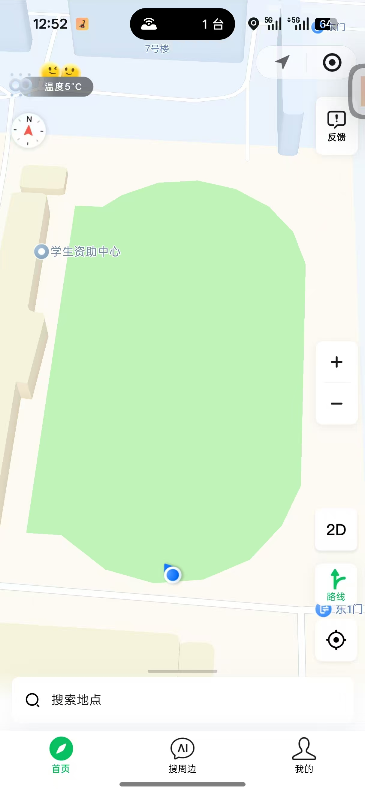

# HookWXMAppLocation

Hook重定位微信小程序定位接口到系统接口，以便 **模拟和调试（比如使用“模拟位置信息应用”调试）** 位置。Hook了比较底层的api，理论上通杀。

**只适用于小程序的定位，微信内部原生的发送、共享位置等等功能不受到影响。**

仅供研究，严禁用于任何违法违规活动，产生后果与作者无关。

思路参考：

https://cloud.tencent.com/developer/article/2216961

